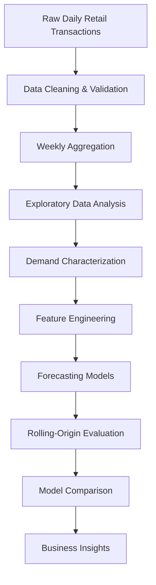

# 📈 Retail Demand Forecasting for Intermittent Demand

> End-to-end retail demand forecasting framework for intermittent demand using **PySpark**, **Exploratory Data Analysis (EDA)**, **feature engineering**, and **classical forecasting methods**.

---

## Overview

Demand forecasting is one of the most critical components of inventory planning within the retail industry. While traditional forecasting methods perform well for products with continuous demand, many retail products exhibit **intermittent demand**, characterized by long periods of zero sales followed by irregular purchasing events.

This project presents an end-to-end demand forecasting framework developed during my Data Science internship for a **major Consumer Packaged Goods (CPG) company**. The project investigates demand characteristics, performs large-scale exploratory data analysis, engineers business-aware forecasting features, and evaluates multiple classical forecasting approaches specifically designed for intermittent demand.

The complete workflow includes:

- Weekly aggregation of 3.3M+ retail transactions
- Large-scale exploratory data analysis (EDA)
- Promotion detection and pricing analysis
- ADI–CV² demand classification
- Holiday and seasonal demand analysis
- Feature engineering for forecasting
- Implementation and benchmarking of Moving Average, Croston, SBA, and TSB forecasting models
- Rolling-origin model evaluation

---

> **Note**
>
> The original dataset belongs to a major Consumer Packaged Goods (CPG) company and cannot be shared publicly. All company-specific identifiers and confidential information have been removed from this repository.

---

# 🎯 Business Problem

Consumer Packaged Goods (CPG) companies manage thousands of products across hundreds of retail stores, making accurate demand forecasting essential for inventory planning and supply chain optimization.

While high-volume products often exhibit stable demand patterns, a significant proportion of Stock Keeping Units (SKUs) experience **intermittent demand**—characterized by long periods of zero sales, irregular purchasing behavior, and unpredictable demand spikes.

These demand characteristics present several challenges:

- 📦 Excess inventory caused by overestimating demand
- 📉 Stockouts resulting from underestimating demand
- 💰 Increased inventory holding and operational costs
- 📊 Reduced forecasting accuracy using conventional time-series models

Traditional forecasting methods generally assume continuous demand and therefore struggle to model sparse retail demand effectively.

This project investigates the characteristics of intermittent demand and evaluates specialized forecasting techniques capable of producing more reliable forecasts for store-product level retail demand.
---

# 🎯 Project Objectives

The primary objectives of this project are:

- Analyze large-scale retail transaction data to understand demand behavior.
- Identify and characterize intermittent demand patterns.
- Determine an appropriate forecasting granularity through data aggregation.
- Perform comprehensive Exploratory Data Analysis (EDA).
- Engineer business-aware forecasting features.
- Benchmark multiple classical forecasting models for intermittent demand.
- Compare forecasting performance using rolling-origin evaluation.
- Derive actionable business insights to support inventory planning.

---

# 📦 Dataset

| Attribute | Value |
|------------|-------|
| Industry | Consumer Packaged Goods (CPG) |
| Company | Major CPG Company *(Anonymized)* |
| Original Records | ~3.3 Million Daily Transactions |
| Stores | 200 |
| Products (SKUs) | 50 |
| Forecast Granularity | Store × Product × Week |
| Weekly Observations | ~478,000 |
| Target Variable | Weekly Sales Volume |

> **Confidentiality Notice**
>
> The original dataset cannot be shared publicly due to confidentiality agreements. All company-specific identifiers have been removed, and no proprietary business data is included in this repository.

---

# ⚙️ Project Workflow

The project follows a complete retail demand forecasting pipeline, beginning with raw daily transactional data and progressing through preprocessing, exploratory analysis, feature engineering, forecasting, and model evaluation. Each stage builds upon insights from the previous step, resulting in a business-oriented forecasting framework for intermittent retail demand.
---

# 🔬 Methodology

The project was executed in the following stages:

### 1. Data Preparation

- Cleaned and validated raw retail transaction data.
- Aggregated daily transactions into weekly observations.
- Selected **Store × Product × Week** as the forecasting granularity to balance sparsity and temporal stability.

---

### 2. Exploratory Data Analysis

Comprehensive exploratory analysis was performed to understand demand behavior and identify the major factors influencing retail sales.

The analysis included:

- Demand distribution analysis
- Promotion detection
- Discount depth analysis
- Store-level demand analysis
- Product-level demand analysis
- Holiday impact analysis
- ADI–CV² demand classification
- Forecastability assessment

---

### 3. Feature Engineering

Business-aware features were engineered to improve forecasting performance.

Examples include:

- Promotion flags
- Price drop percentage
- Discount buckets
- Holiday indicators
- Holiday window features
- Weekly average price
- Rolling statistics
- Temporal variables

---

### 4. Forecasting

Multiple forecasting approaches were implemented and benchmarked:

- Moving Average
- Croston's Method
- Syntetos–Boylan Approximation (SBA)
- Teunter–Syntetos–Babai (TSB)

---

### 5. Evaluation

Forecasts were evaluated using rolling-origin evaluation to simulate real-world forecasting scenarios.

Evaluation metrics included:

- Mean Absolute Error (MAE)
- Root Mean Squared Error (RMSE)
- Forecast Bias
- Runtime
