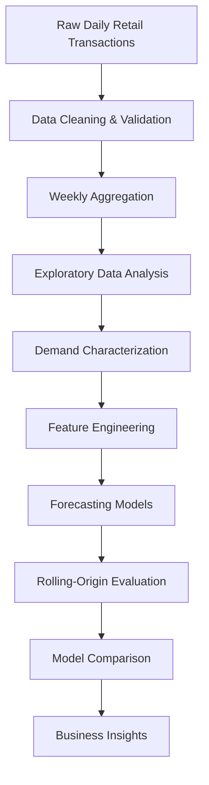

# 📈 Retail Demand Forecasting for Intermittent Demand

> End-to-end retail demand forecasting framework for intermittent demand using **PySpark**, **Exploratory Data Analysis (EDA)**, **feature engineering**, and **classical forecasting methods**.


---
## 📑 Table of Contents

- [Overview](#overview)
- [Business Problem](#-business-problem)
- [Project Objectives](#-project-objectives)
- [Dataset](#-dataset)
- [Project Workflow](#️-project-workflow)
- [Methodology](#-methodology)
- [Exploratory Data Analysis](#-exploratory-data-analysis-eda)
- [Forecasting Models](#-forecasting-models)
- [Results](#-results)
- [Key Business Insights](#-key-business-insights)
- [Repository Structure](#-repository-structure)
- [Installation](#-installation)
- [Usage](#️-usage)
- [Reports](#-reports)
- [Future Improvements](#-future-improvements)
- [Limitations](#️-limitations)
- [Acknowledgements](#-acknowledgements)
- [Author](#-author)

## Overview

Demand forecasting is one of the most critical components of inventory planning within the retail industry. While traditional forecasting methods perform well for products with continuous demand, many retail products exhibit **intermittent demand**, characterized by long periods of zero sales followed by irregular purchasing events.

This project presents an end-to-end demand forecasting framework developed during my Data Science internship for a **major Consumer Packaged Goods (CPG) company**. The project investigates demand characteristics, performs large-scale exploratory data analysis, engineers business-aware forecasting features, and evaluates multiple classical forecasting approaches specifically designed for intermittent demand.

The complete workflow includes:

- Weekly aggregation of 3.3M+ retail transactions
- Large-scale exploratory data analysis (EDA)
- Promotion detection and pricing analysis
- ADI–CV² demand classification
- Holiday and seasonal demand analysis
- Feature engineering for forecasting
- Implementation and benchmarking of Moving Average, Croston, SBA, and TSB forecasting models
- Rolling-origin model evaluation

---

> **Note**
>
> The original dataset belongs to a major Consumer Packaged Goods (CPG) company and cannot be shared publicly. All company-specific identifiers and confidential information have been removed from this repository.

---

# 🎯 Business Problem

Consumer Packaged Goods (CPG) companies manage thousands of products across hundreds of retail stores, making accurate demand forecasting essential for inventory planning and supply chain optimization.

While high-volume products often exhibit stable demand patterns, a significant proportion of Stock Keeping Units (SKUs) experience **intermittent demand**—characterized by long periods of zero sales, irregular purchasing behavior, and unpredictable demand spikes.

These demand characteristics present several challenges:

- 📦 Excess inventory caused by overestimating demand
- 📉 Stockouts resulting from underestimating demand
- 💰 Increased inventory holding and operational costs
- 📊 Reduced forecasting accuracy using conventional time-series models

Traditional forecasting methods generally assume continuous demand and therefore struggle to model sparse retail demand effectively.

This project investigates the characteristics of intermittent demand and evaluates specialized forecasting techniques capable of producing more reliable forecasts for store-product level retail demand.
---

# 🎯 Project Objectives

The primary objectives of this project are:

- Analyze large-scale retail transaction data to understand demand behavior.
- Identify and characterize intermittent demand patterns.
- Determine an appropriate forecasting granularity through data aggregation.
- Perform comprehensive Exploratory Data Analysis (EDA).
- Engineer business-aware forecasting features.
- Benchmark multiple classical forecasting models for intermittent demand.
- Compare forecasting performance using rolling-origin evaluation.
- Derive actionable business insights to support inventory planning.

---

# 📦 Dataset

| Attribute | Value |
|------------|-------|
| Industry | Consumer Packaged Goods (CPG) |
| Company | Major CPG Company *(Anonymized)* |
| Original Records | ~3.3 Million Daily Transactions |
| Stores | 200 |
| Products (SKUs) | 50 |
| Forecast Granularity | Store × Product × Week |
| Weekly Observations | ~478,000 |
| Target Variable | Weekly Sales Volume |

> **Confidentiality Notice**
>
> The original dataset cannot be shared publicly due to confidentiality agreements. All company-specific identifiers have been removed, and no proprietary business data is included in this repository.

---

# ⚙️ Project Workflow


The project follows a complete retail demand forecasting pipeline, beginning with raw daily transactional data and progressing through preprocessing, exploratory analysis, feature engineering, forecasting, and model evaluation. Each stage builds upon insights from the previous step, resulting in a business-oriented forecasting framework for intermittent retail demand.
---

# 🔬 Methodology

The project was executed in the following stages:

### 1. Data Preparation

- Cleaned and validated raw retail transaction data.
- Aggregated daily transactions into weekly observations.
- Selected **Store × Product × Week** as the forecasting granularity to balance sparsity and temporal stability.

---

### 2. Exploratory Data Analysis

Comprehensive exploratory analysis was performed to understand demand behavior and identify the major factors influencing retail sales.

The analysis included:

- Demand distribution analysis
- Promotion detection
- Discount depth analysis
- Store-level demand analysis
- Product-level demand analysis
- Holiday impact analysis
- ADI–CV² demand classification
- Forecastability assessment

---

### 3. Feature Engineering

Business-aware features were engineered to improve forecasting performance.

Examples include:

- Promotion flags
- Price drop percentage
- Discount buckets
- Holiday indicators
- Holiday window features
- Weekly average price
- Rolling statistics
- Temporal variables

---

### 4. Forecasting

Multiple forecasting approaches were implemented and benchmarked:

- Moving Average
- Croston's Method
- Syntetos–Boylan Approximation (SBA)
- Teunter–Syntetos–Babai (TSB)

---

### 5. Evaluation

Forecasts were evaluated using rolling-origin evaluation to simulate real-world forecasting scenarios.

Evaluation metrics included:

- Mean Absolute Error (MAE)
- Root Mean Squared Error (RMSE)
- Forecast Bias
- Runtime
---

# 📊 Exploratory Data Analysis (EDA)

A comprehensive exploratory analysis was performed to understand retail demand behavior before model development. The analysis focused on identifying demand sparsity, promotional effects, seasonality, store-product variability, and demand intermittency.

## Key Analyses

### 📈 Demand Characteristics

- Analyzed weekly demand distributions across stores and products.
- Identified sparse demand patterns with frequent zero-demand periods.
- Selected weekly aggregation to reduce sparsity while preserving purchasing behavior.

---

### 🏷️ Promotion Detection

- Estimated regular selling prices for each Store–Product combination.
- Calculated percentage price drops to identify promotional periods.
- Derived business features including:
  - `promo_flag`
  - `price_drop_pct`
  - `discount_bucket`

> **Key Insight:** Only a small proportion of observations were promotional, but promotions produced significant temporary demand uplift.

<!-- Add Figure: Promotion Distribution -->

---

### 🛒 Store & Product Analysis

Demand behavior was analyzed at both store and product levels to understand purchasing variability across the retail network.

The analysis revealed:

- Different promotional effectiveness across stores
- Product-specific promotion sensitivity
- Significant variation in average weekly demand

These findings justified forecasting at the **Store × Product** level rather than using aggregated demand.

<!-- Add Figure: Store Promotion Lift -->

---

### 🎄 Holiday Analysis

Demand was compared across:

- Pre-Holiday
- Holiday
- Post-Holiday
- Normal Weeks

Holiday periods consistently exhibited higher demand and sales value, supporting the inclusion of calendar-based forecasting features.

<!-- Add Figure: Holiday Analysis -->

---

### 📉 ADI–CV² Demand Classification

Demand series were classified using the ADI–CV² framework into:

- Smooth
- Erratic
- Intermittent
- Lumpy

> **Key Finding:** Approximately **63%** of Store–Product series exhibited **Intermittent Demand**, validating the need for specialized forecasting techniques.

<!-- Add Figure: ADI-CV² Classification -->

---

# 🤖 Forecasting Models

Four forecasting approaches were implemented and benchmarked.

| Model | Description |
|--------|-------------|
| **Moving Average (MA)** | Traditional baseline forecasting model using historical averages. |
| **Croston's Method** | Specialized forecasting method designed for intermittent demand. |
| **SBA (Syntetos–Boylan Approximation)** | Bias-corrected extension of Croston's method. |
| **TSB (Teunter–Syntetos–Babai)** | Separately models demand occurrence and demand size for intermittent series. |

To simulate real-world forecasting, all models were evaluated using **rolling-origin evaluation**, ensuring forecasts were generated only from historical observations available at each prediction step.

---

# 🏆 Results

The forecasting models were compared using rolling-origin evaluation to simulate real-world forecasting conditions.

| Model | MAE ↓ | RMSE ↓ | Runtime (s) ↓ | Relative Bias ↓ |
|:------|------:|-------:|--------------:|----------------:|
| **Moving Average (4)** ⭐ | **0.943** | **1.546** | **0.14** | **0.066** |
| TSB | 0.981 | 1.548 | 6.35 | 0.152 |
| SBA | 1.138 | 1.699 | 5.99 | 0.204 |
| Croston | 1.168 | 1.738 | 6.86 | 0.267 |

### Key Findings

- 🏆 **Moving Average (4)** achieved the best overall forecasting performance.
- ⚡ It also had the lowest runtime, making it the most computationally efficient approach.
- 📉 Specialized intermittent-demand models remained competitive but required significantly higher computational time.
- 📊 Rolling-origin evaluation provided a realistic estimate of forecasting performance in production-like scenarios.

> **Overall Conclusion**
>
> For this dataset, a well-configured Moving Average baseline outperformed specialized intermittent-demand forecasting methods, demonstrating that simpler models can remain highly competitive when the forecasting granularity and evaluation strategy are carefully selected.

---

# 💡 Key Business Insights

The project generated several business insights beyond forecasting accuracy.

- 📦 Weekly aggregation substantially reduced demand sparsity while preserving purchasing behavior.
- 🏷️ Promotions produced measurable demand uplift but occurred in only a small proportion of observations.
- 🛒 Promotional effectiveness varied considerably across stores and products, indicating location-specific and product-specific purchasing behavior.
- 🎄 Holiday periods consistently exhibited increased sales activity, supporting the inclusion of calendar-based features.
- 📉 Approximately **63%** of Store–Product series were classified as **Intermittent Demand**, confirming the suitability of specialized forecasting methods for evaluation.
- 📊 Forecasting at the **Store × Product × Week** level preserved important local demand characteristics that would have been lost through aggregation.

---

# 📂 Repository Structure

```
retail-demand-forecasting-intermittent-demand/
│
├── notebooks/
│   ├── 01_EDA.ipynb
│   └── 02_Modeling.ipynb
│
├── reports/
│   ├── Technical_Report.pdf
│   └── Technical_Presentation.pdf
│
├── images/
│
├── data/
│   └── README.md
│
├── .gitignore
├── LICENSE
├── README.md
└── requirements.txt
```
---

# 🚀 Installation

Clone the repository:

```bash
git clone https://github.com/Anubhavx2026/retail-demand-forecasting-intermittent-demand.git
cd retail-demand-forecasting-intermittent-demand
```

Install the required Python packages:

```bash
pip install -r requirements.txt
```
---

# ▶️ Usage

The project is organized into two primary notebooks:

| Notebook | Description |
|-----------|-------------|
| **01_EDA.ipynb** | Data preprocessing, aggregation, exploratory data analysis, promotion detection, demand characterization, and business insights. |
| **02_Modeling.ipynb** | Feature engineering, forecasting model implementation, rolling-origin evaluation, and model comparison. |

> **Note**
>
> The original dataset is not included in this repository due to confidentiality restrictions. Replace it with a dataset following the documented schema to reproduce the workflow.

---

# 📚 Reports

Complete project documentation is available in the **reports/** directory.

- 📄 Technical Report
- 📊 Project Presentation

These documents provide detailed explanations of the methodology, exploratory analysis, forecasting models, evaluation strategy, and business recommendations.

---

# 🔮 Future Improvements

Potential extensions of this project include:

- Implementation of machine learning forecasting models (XGBoost, LightGBM, CatBoost).
- Evaluation of deep learning architectures such as LSTM, Temporal Fusion Transformer (TFT), and N-BEATS.
- Automated hyperparameter optimization.
- Hierarchical demand forecasting.
- Probabilistic forecasting and prediction intervals.
- MLOps deployment pipeline for automated weekly forecasting.
- Interactive dashboards for business users using Streamlit or Power BI.

---

# ⚠️ Limitations

- The original dataset cannot be shared publicly due to confidentiality agreements.
- Results are specific to the anonymized retail dataset used during the internship.
- The repository focuses on classical forecasting techniques rather than machine learning or deep learning approaches.

---

# 🙏 Acknowledgements

This project was developed during my **Data Science Internship at Sigmoid Analytics** using anonymized retail transaction data provided by a major Consumer Packaged Goods (CPG) company.

Special thanks to my mentors and reviewers for their guidance on forecasting methodology, evaluation strategy, and technical documentation.

---

# 👨‍💻 Author

**Anubhav Anand**

B.Tech. Computer Science & Engineering

Data Science • Machine Learning • Time-Series Forecasting

📧 anubhavx2026@gmail.com

🔗 LinkedIn: https://linkedin.com/in/aanand13

💻 GitHub: https://github.com/Anubhavx2026

---

⭐ If you found this repository useful, consider giving it a star.
